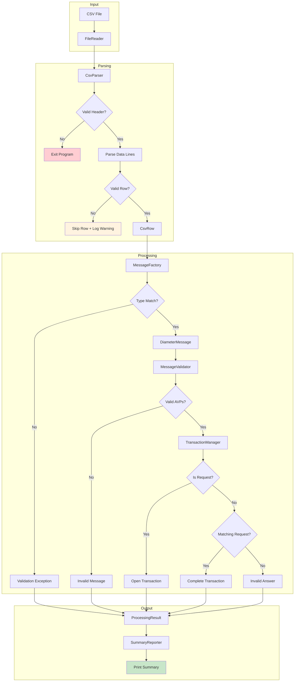
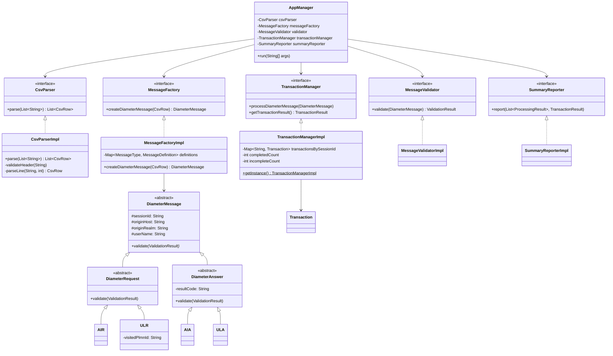

# Diameter S6a CSV Processor

A Java application that processes Diameter S6a protocol messages from CSV files, implementing message validation, transaction management, and summary reporting per 3GPP TS 29.272 specifications.

---

## Table of Contents

1. [Design Overview](#design-overview)
2. [Design Decisions](#design-decisions)
3. [Performance Implications](#performance-implications)
4. [Testing Methodology](#testing-methodology)
5. [Assumptions](#assumptions)
6. [AI Disclosure](#ai-disclosure)
7. [Getting Started](#getting-started)

---

## Design Overview

### High-Level Architecture



### Class Diagram



### Key Components

| Component | Responsibility |
|-----------|----------------|
| **AppManager** | Orchestrates the processing pipeline; wires all components |
| **CsvParser** | Parses CSV content into `CsvRow` objects with header validation |
| **MessageFactory** | Creates typed `DiameterMessage` instances from CSV rows |
| **MessageValidator** | Validates mandatory AVPs per message type |
| **TransactionManager** | Tracks request/answer pairs by Session-Id |
| **SummaryReporter** | Formats and outputs processing statistics |

---

## Design Decisions

### Design Patterns

| Pattern | Usage |
|---------|-------|
| **Factory Method** | `MessageFactory` creates concrete message types (`AIR`, `AIA`, `ULR`, `ULA`) based on `MessageType` enum |
| **Singleton** | `TransactionManagerImpl` uses double-checked locking singleton for centralized transaction state |
| **Template Method** | `DiameterMessage.validate()` defines validation structure; subclasses extend with type-specific rules |

### Separation of Validation Concerns

Validation is split into two distinct layers:

1. **Structural Validation** (in `MessageFactory`)
   - Enforces type consistency (e.g., `AIR` must have `is_request=true`)
   - Fails fast with `DiameterMessageValidationException`
   - Prevents creation of structurally invalid objects

2. **Mandatory Field Validation** (in `DiameterMessage` subclasses)
   - Validates AVP presence per 3GPP specification
   - Delegated to message classes for maintainability
   - Collects all errors (does not fail on first error)

**Rationale:** This separation ensures that invalid objects cannot be constructed, while field validation remains extensible and localized to each message type.

### CSV Validation Policy

| Scenario | Behavior |
|----------|----------|
| Invalid/missing header | Exit program immediately |
| Invalid data row | Skip row, log warning, continue processing |
| Empty CSV (header only) | Report zero messages processed |

**Rationale:** Header errors indicate a fundamentally malformed file; row errors may be recoverable data issues.

### Statistics Collection Tradeoff

**Chosen approach:** Statistics are coupled with `AppManager` for O(1) updates during processing.

**Alternative considered:** Separate statistics component with O(n) post-processing iteration over results.

**Decision rationale:** The coupled approach avoids a second pass over all results and keeps the processing loop simple. For this use case, the slight coupling is acceptable; for larger systems, a separate collector with event-driven updates would be preferable.

### Protocol Extensibility

The current design supports **non-extendable protocol** semantics:

- Message types are defined as an enum (`MessageType`)
- Adding new message types requires code changes to `MessageType`, `MessageFactory`, and validation rules

**For extendable protocols** (e.g., future AVP additions), consider:
- Plugin-based message registration
- Configuration-driven AVP rules
- Dynamic validation rule loading

---

## Performance Implications

### CPU

- **Complexity:** O(n) where n = number of CSV rows
- **Per-message operations:** O(1) - HashMap lookups, field validation
- **No bottleneck:** String operations and map operations are efficient

### Memory

| Concern | Impact | Mitigation |
|---------|--------|------------|
| `Files.readAllLines()` | Loads entire file into memory | For large files, switch to streaming with `BufferedReader` |
| `List<CsvRow>` | Duplicates parsed data | Consider processing rows as they are parsed |
| `openTransactions` map | Grows with unmatched requests | Add transaction timeout/expiry for production use |

**Worst case:** If CSV contains 1M requests with no answers, all 1M transactions remain in memory.

### Transaction Map Growth

The `TransactionManagerImpl.transactionsBySessionId` map holds all open (unmatched) transactions:

- **Growth:** Linear with number of unanswered requests
- **Risk:** Memory exhaustion with pathological input (all requests, no answers)
- **Production mitigation:** Implement transaction timeout, max capacity, or LRU eviction

### Locking / Concurrency

**Current design:** Single-threaded; no synchronization required.

**If parallelized:**
- `TransactionManagerImpl` becomes a contention point
- Requires `ConcurrentHashMap` and atomic counters
- Consider partitioning by Session-Id hash for lock-free scaling

### Scalability Constraints

| Constraint | Limit |
|------------|-------|
| File size | Limited by available heap memory |
| Transaction count | Limited by heap; no eviction policy |
| Throughput | Single-threaded; ~100K msg/sec typical |

---

## Testing Methodology

### Test Strategy Overview

| Test Type | Purpose | Coverage |
|-----------|---------|----------|
| **Unit Tests** | Test components in isolation | Parser, Factory, Validator, TransactionManager |
| **Integration Tests** | Test full pipeline with realistic data | End-to-end message processing |
| **Data-Driven Tests** | Validate against CSV test files | Parameterized scenarios |

### Unit Test Coverage

| Component | Test Class | Key Scenarios |
|-----------|------------|---------------|
| CsvParser | `CsvParserImplTest` | Header validation, line parsing, whitespace handling, malformed rows |
| MessageFactory | `MessageFactoryImplTest` | Type creation, type mismatch detection, null handling |
| MessageValidator | `MessageValidatorImplTest` | Each AVP rule, error collection, empty/blank handling |
| TransactionManager | `TransactionManagerImplTest` | Open/complete transactions, duplicate requests, orphan answers, type-pair matching |
| SummaryReporter | `SummaryReporterImplTest` | Output formatting, count accuracy |
| DiameterMessage | `DiameterMessageTest` | Message hierarchy, type-specific validation |

### Data-Driven CSV Testing

Test data files in `src/test/resources/testdata/`:

| File | Scenario |
|------|----------|
| `valid_complete_transactions.csv` | Happy path - all transactions complete |
| `open_transactions.csv` | Requests without matching answers |
| `invalid_messages.csv` | Messages with missing mandatory AVPs |
| `spec_example.csv` | Example from specification document |
| `out_of_order_answers.csv` | Answers in different order than requests |
| `type_mismatch.csv` | Request/Answer type mismatches |

### Validation & Edge Case Coverage

- **Empty/null fields:** Treated as absent AVPs
- **Whitespace-only fields:** Treated as absent AVPs
- **Duplicate Session-Id:** Throws `DuplicateTransactionException`
- **Orphan answers:** Throws `UnexpectedTransactionAnswerException`
- **Type-pair mismatch:** AIR↔AIA, ULR↔ULA enforced; mismatches do not complete transaction

### Exception Testing Strategy

| Exception | Trigger | Test Verification |
|-----------|---------|-------------------|
| `CsvValidationException` | Invalid header, malformed rows | Asserts exception thrown with descriptive message |
| `DiameterMessageValidationException` | Type/is_request mismatch | Asserts exception and message counted as invalid |
| `DuplicateTransactionException` | Same Session-Id twice | Asserts exception contains Session-Id |
| `UnexpectedTransactionAnswerException` | Answer without request | Asserts exception and proper counter increment |

### Production Safety Guarantees

1. **Invariant enforcement:** `valid + invalid = total` verified in integration tests
2. **No silent failures:** All exceptions are caught and counted
3. **Deterministic behavior:** Tests are repeatable with no shared mutable state (singleton reset between tests)
4. **Boundary testing:** Empty CSV, single message, large session IDs tested

### Invalid Answer Behavior

**Question:** Does an invalid answer increase the invalid message counter?

**Answer:** Yes. When an answer arrives without a matching request:
1. `TransactionException` is thrown
2. The exception is caught in `AppManager.processSingleRow()`
3. A `ProcessingResult.error()` is returned
4. This result is counted as invalid in the summary

---

## Assumptions

1. **Input file format:** The input file is a valid CSV with the required columns in any order
2. **AVP alignment:** Diameter request/answer AVP requirements differ (requests require User-Name; answers require Result-Code)
3. **Common fields:** `sessionId`, `originHost`, `originRealm`, `userName` are defined in `DiameterMessage` base class
4. **Session-Id uniqueness:** Each request has a unique Session-Id; duplicates are errors
5. **Transaction pairing:** AIR must be answered by AIA; ULR must be answered by ULA
6. **Single-threaded execution:** The application processes messages sequentially

---

## AI Disclosure

> **Transparency Notice**
>
> This project was developed with significant AI assistance:
>
> - **Test Suite:** Approximately **95%** of the test code was generated by AI, including test classes, test data files, and test utilities.
> - **Production Code:** Approximately **20%** of the code in `src/main/java` was AI-assisted, primarily in boilerplate generation and structural scaffolding.
> - **Documentation:** The system documentation and this README were authored by AI based on codebase analysis.
>
> All AI-generated code was reviewed and validated for correctness, adherence to specifications, and production quality standards.

---

## Getting Started

### Prerequisites

- Java 17 or higher
- Gradle 8.x (wrapper included)

### Build

```bash
./gradlew build
```

### Run Tests

```bash
./gradlew test
```

### Run Application

```bash
./gradlew run --args="path/to/input.csv"
```

### Project Structure

```
diameter-s6a/
├── src/
│   ├── main/java/diameter/
│   │   ├── app/           # Application orchestration
│   │   ├── csv/           # CSV parsing
│   │   ├── domain/        # Message hierarchy & factory
│   │   ├── exception/     # Custom exceptions
│   │   ├── io/            # File I/O
│   │   ├── reporter/      # Summary reporting
│   │   ├── transaction/   # Transaction management
│   │   └── validator/     # Message validation
│   └── test/
│       ├── java/diameter/ # Test classes
│       └── resources/testdata/ # CSV test files
├── docs/
│   └── SYSTEM_DOCUMENTATION.md  # Extended technical documentation
└── README.md
```

---

## Extended Documentation

For detailed class diagrams, sub-process flows, and component specifications, see:

📄 **[docs/SYSTEM_DOCUMENTATION.md](docs/SYSTEM_DOCUMENTATION.md)**

---

## License

This project was created as a technical assessment submission.

