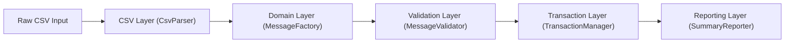
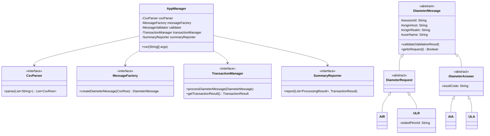

# Diameter S6a CSV Processor

A Java application that processes Diameter S6a protocol messages from CSV files, implementing message validation, transaction management, and summary reporting.

📄 **Extended Documentation:** [docs/SYSTEM_DOCUMENTATION.md](docs/SYSTEM_DOCUMENTATION.md)

---

## AI Disclosure

This project was developed with AI assistance:
- **Source Code:** ~25% AI-assisted (boilerplate, scaffolding, logging, design decisions)
- **Test Suite:** ~95% AI-generated (test classes, data files, utilities)
- **Documentation:** AI-authored based on codebase analysis

All AI-generated code was reviewed and validated for correctness and code quality.

---

## Assumptions

1. `sessionId`, `originHost`, `originRealm`, `userName` are in the base `DiameterMessage` class (mandatory only in requests)
2. Each request has a unique Session-Id; duplicates are errors
3. Single-threaded execution
4. **Orphan answers** (answers without matching requests) are counted as invalid messages

---

## Design Overview

### Key Components

| Component              | Responsibility                                     |
|------------------------|----------------------------------------------------|
| **AppManager**         | Orchestrates the pipeline; wires all components    |
| **CsvParser**          | Parses CSV into `CsvRow` objects; validates header |
| **MessageFactory**     | Creates typed `DiameterMessage` instances          |
| **MessageValidator**   | Validates mandatory AVPs per message type          |
| **TransactionManager** | Tracks request/answer pairs by Session-Id          |
| **SummaryReporter**    | Formats and outputs processing statistics          |



See [Class Diagram](#class-diagram) for high-level architecture.

---

## Design Decisions

### Design Patterns

| Pattern             | Usage                                                                                        |
|---------------------|----------------------------------------------------------------------------------------------|
| **Factory Method**  | `MessageFactory` creates concrete types (`AIR`, `AIA`, `ULR`, `ULA`) from `MessageType` enum |
| **Singleton**       | `TransactionManagerImpl` uses double-checked locking for centralized state                   |
| **Template Method** | `DiameterMessage.validate()` defines structure; subclasses add type-specific rules           |

### Validation Separation

| Layer                | Location                     | Behavior                                                          |
|----------------------|------------------------------|-------------------------------------------------------------------|
| **Structural**       | `CsvParser`                  | Enforces type consistency (e.g., AIR must be request); fails fast |
| **Mandatory Fields** | `DiameterMessage` subclasses | Validates AVPs per spec; collects all errors                      |

### CSV Validation Policy

| Scenario         | Behavior                      |
|------------------|-------------------------------|
| Invalid header   | Exit immediately              |
| Invalid data row | Skip row, continue processing |

### Protocol Extensibility

The design is **extensible** via the Factory Method pattern:
- Add new `MessageType` enum value
- Create new message class extending `DiameterRequest`/`DiameterAnswer`
- Register in `MessageFactory`

For dynamic extensibility (e.g., plugin-based AVPs), we can use reflection or configuration-driven rules.

### Statistics Tradeoff

**Chosen:** Coupled with `AppManager` for O(1) updates during processing.  
**Alternative:** Separate collector with O(n) post-processing. Acceptable tradeoff for this scope.

---

## Performance Implications

### CPU
- **Complexity:** O(n×m) where n = rows, m = fields per row
- **Per-message:** O(1) HashMap lookups and validation

### Memory

| Concern                                             | Mitigation                                     |
|-----------------------------------------------------|------------------------------------------------|
| `Files.readAllLines()` loads entire file            | Use `BufferedReader` streaming for large files |
| Open transactions map grows with unmatched requests | Implement timeout/LRU eviction for production  |

**Worst case:** 1M unanswered requests = 1M transactions in memory.

### Concurrency

**Current:** Single-threaded; no synchronization needed.

**If parallelized:** Use `ConcurrentHashMap`, atomic counters, and consider Session-Id partitioning.

---

## Testing Methodology

### Test Strategy

| Type            | Purpose                                                                  |
|-----------------|--------------------------------------------------------------------------|
| **Unit**        | Components in isolation (Parser, Factory, Validator, TransactionManager) |
| **Integration** | Full pipeline with realistic data                                        |
| **Data-Driven** | Parameterized CSV scenarios                                              |

### Test Data Files (`src/test/resources/testdata/`)

| File                              | Scenario                  |
|-----------------------------------|---------------------------|
| `valid_complete_transactions.csv` | Happy path                |
| `open_transactions.csv`           | Unanswered requests       |
| `invalid_messages.csv`            | Missing AVPs              |
| `type_mismatch.csv`               | Request/Answer mismatches |

### Edge Cases Covered

- Empty/whitespace fields → absent AVPs
- Duplicate Session-Id → `DuplicateTransactionException`
- Orphan answers → `UnexpectedTransactionAnswerException`
- Type-pair enforcement: AIR↔AIA, ULR↔ULA

---

## Class Diagram



---

## Getting Started

**Prerequisites:** Java 17+, Gradle 8.x (wrapper included)

```bash
./gradlew build                           # Build
./gradlew test                            # Run tests
./gradlew run --args="path/to/input.csv"  # Run application
```

### Logging

The application uses **SLF4J** with **Logback** for production-grade logging.

| Log Level | Purpose |
|-----------|---------|
| **INFO** | Startup/shutdown, file I/O, processing summaries |
| **WARN** | Validation failures, skipped rows, transaction errors |
| **ERROR** | Fatal errors, file read failures, invalid arguments |
| **DEBUG** | Detailed transaction state, parsing details |

**Configuration:** `src/main/resources/logback.xml`

**Log files:** `logs/diameter-s6a.log` (rotated daily, 30-day retention)

---

## License

This project was created as a technical assessment submission.
