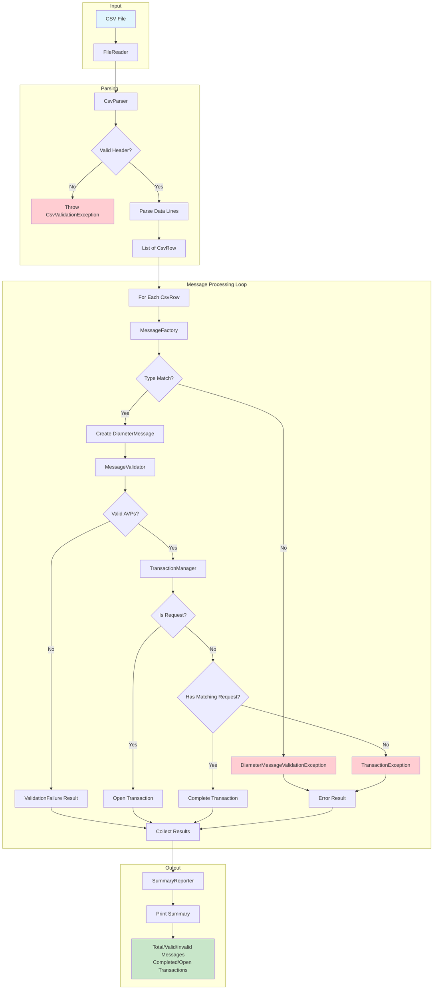
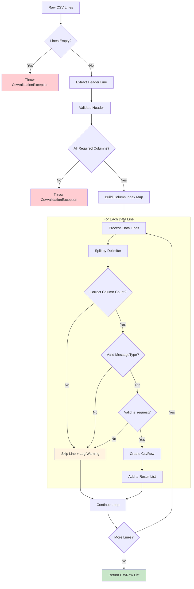
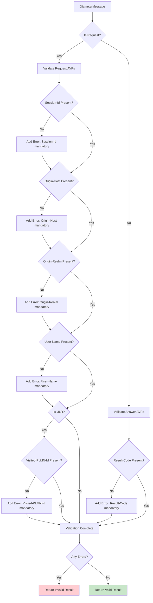
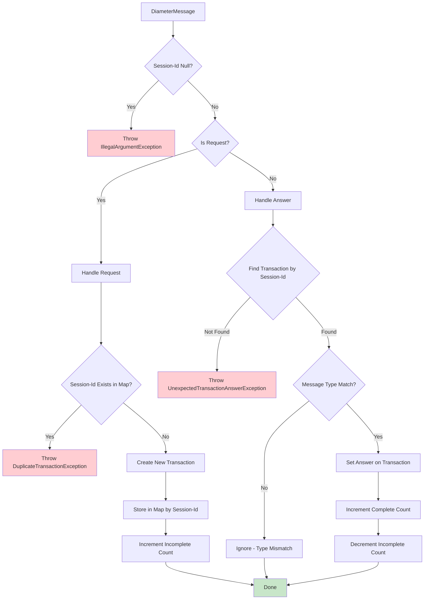
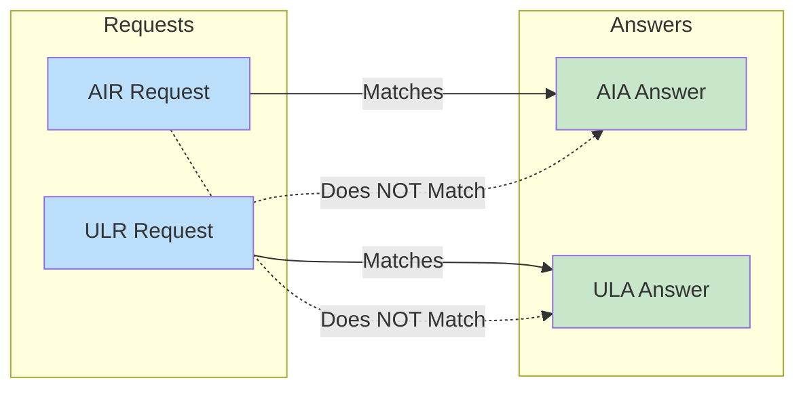
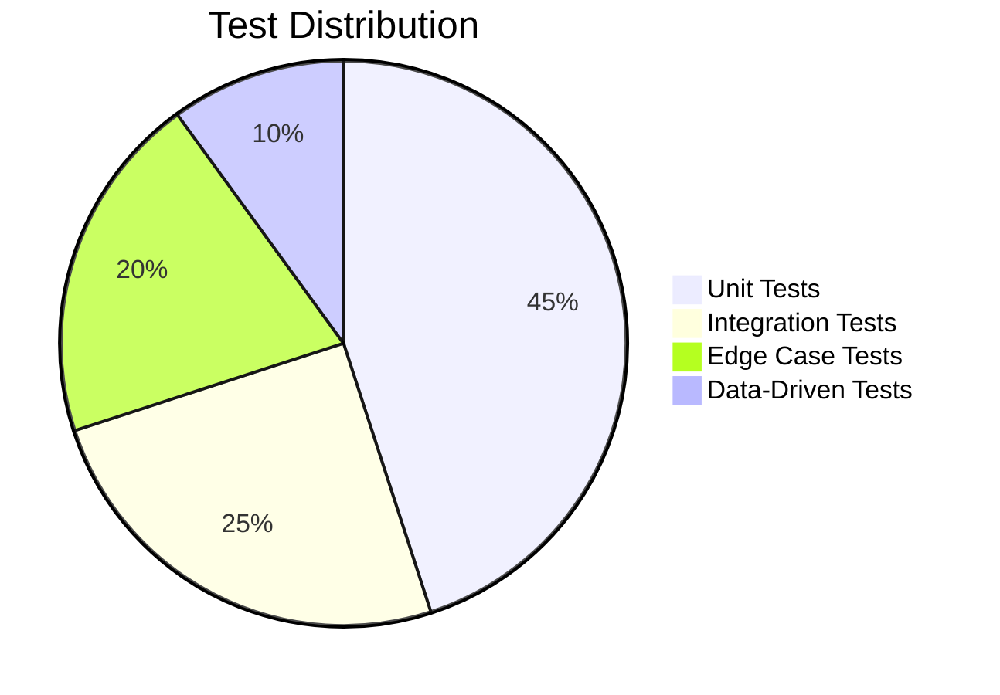

# Diameter S6a CSV Processor - System Documentation

## Table of Contents
1. [System Overview](#system-overview)
2. [Architecture](#architecture)
3. [Class Diagram](#class-diagram)
4. [Main Flow Diagram](#main-flow-diagram)
5. [Sub-Process Flows](#sub-process-flows)
6. [Component Details](#component-details)
7. [Test Coverage](#test-coverage)

---

## System Overview

The Diameter S6a CSV Processor is a Java application that processes Diameter S6a protocol messages from CSV files. It implements:

- **Message Parsing**: Converts CSV rows into typed Diameter message objects
- **Validation**: Enforces mandatory AVP (Attribute-Value Pair) rules per 3GPP TS 29.272
- **Transaction Management**: Tracks request/answer pairs by Session-Id
- **Reporting**: Generates processing summaries with statistics

### Supported Message Types

| Message | Type | Description |
|---------|------|-------------|
| AIR | Request | Authentication-Information-Request |
| AIA | Answer | Authentication-Information-Answer |
| ULR | Request | Update-Location-Request |
| ULA | Answer | Update-Location-Answer |

---

## Architecture

The system follows a layered architecture with clear separation of concerns:

```
┌─────────────────────────────────────────────────────────────────┐
│                        Application Layer                        │
│                         (AppManager)                            │
├─────────────────────────────────────────────────────────────────┤
│    CSV Layer    │   Domain Layer   │   Validation Layer         │
│   (CsvParser)   │ (MessageFactory) │  (MessageValidator)        │
├─────────────────────────────────────────────────────────────────┤
│                     Transaction Layer                           │
│                   (TransactionManager)                          │
├─────────────────────────────────────────────────────────────────┤
│                      Reporting Layer                            │
│                    (SummaryReporter)                            │
└─────────────────────────────────────────────────────────────────┘
```

---

## Class Diagram

```mermaid
classDiagram
    direction TB
    
    %% Application Layer
    class AppManager {
        -CsvParser csvParser
        -MessageFactory messageFactory
        -MessageValidator validator
        -TransactionManager transactionManager
        -SummaryReporter summaryReporter
        +run(String[] args) void
        -handleMessagesToTransactions(List~CsvRow~) void
        -processSingleRow(CsvRow) ProcessingResult
        -getCsvRows(String[]) List~CsvRow~
    }

    %% CSV Layer
    class CsvParser {
        <<interface>>
        +parse(List~String~) List~CsvRow~
    }

    class CsvParserImpl {
        -String DELIMITER
        -Map~CsvColumn, Integer~ headerMap
        +parse(List~String~) List~CsvRow~
        -parseLine(String, int) CsvRow
        -validateHeader(String) void
        -validateLine(String[], int) void
    }

    class CsvRow {
        -MessageType messageType
        -boolean isRequest
        -String sessionId
        -String originHost
        -String originRealm
        -String userName
        -String visitedPlmnId
        -String resultCode
        +getMessageType() MessageType
        +getIsRequest() boolean
        +getSessionId() String
        +getOriginHost() String
        +getOriginRealm() String
        +getUserName() String
        +getVisitedPlmnId() String
        +getResultCode() String
    }

    class CsvColumn {
        <<enumeration>>
        MESSAGE_TYPE
        IS_REQUEST
        SESSION_ID
        ORIGIN_HOST
        ORIGIN_REALM
        USER_NAME
        VISITED_PLMN_ID
        RESULT_CODE
    }

    %% Domain Layer - Message Hierarchy
    class DiameterMessage {
        <<abstract>>
        #MessageType messageType
        #boolean isRequest
        #String sessionId
        #String originHost
        #String originRealm
        #String userName
        +validate(ValidationResult) void*
        #require(String, String, ValidationResult) void
        +getMessageType() MessageType
        +getIsRequest() boolean
        +getSessionId() String
    }

    class DiameterRequest {
        <<abstract>>
        +validate(ValidationResult) void
    }

    class DiameterAnswer {
        <<abstract>>
        -String resultCode
        +validate(ValidationResult) void
    }

    class AIR {
        +AIR(String, String, String, String)
    }

    class ULR {
        -String visitedPlmnId
        +ULR(String, String, String, String, String)
        +validate(ValidationResult) void
    }

    class AIA {
        +AIA(String, String, String, String, String)
    }

    class ULA {
        +ULA(String, String, String, String, String)
    }

    class MessageType {
        <<enumeration>>
        AIR
        AIA
        ULR
        ULA
    }

    %% Factory
    class MessageFactory {
        <<interface>>
        +createDiameterMessage(CsvRow) DiameterMessage
    }

    class MessageFactoryImpl {
        -Map~MessageType, MessageDefinition~ messageDefinitions
        +createDiameterMessage(CsvRow) DiameterMessage
    }

    %% Validation Layer
    class MessageValidator {
        <<interface>>
        +validate(DiameterMessage) ValidationResult
    }

    class MessageValidatorImpl {
        +validate(DiameterMessage) ValidationResult
    }

    class ValidationResult {
        -List~String~ errors
        +addError(String) void
        +isValid() boolean
        +getErrors() List~String~
    }

    %% Transaction Layer
    class TransactionManager {
        <<interface>>
        +processDiameterMessage(DiameterMessage) void
        +getTransactionResult() TransactionResult
    }

    class TransactionManagerImpl {
        -TransactionManagerImpl instance$
        -int numberOfCompleteTransactions
        -int numberOfIncompleteTransactions
        -Map~String, Transaction~ transactionsBySessionId
        -Map~MessageType, MessageType~ answerByRequest$
        +getInstance()$ TransactionManagerImpl
        +processDiameterMessage(DiameterMessage) void
        +getTransactionResult() TransactionResult
        -handleRequestMessage(DiameterMessage) void
        -handleAnswerMessage(DiameterMessage) void
    }

    class Transaction {
        -DiameterMessage request
        -DiameterMessage answer
        +getRequest() DiameterMessage
        +getAnswer() DiameterMessage
        +setAnswer(DiameterMessage) void
    }

    class TransactionResult {
        -int numberOfCompleteTransactions
        -int numberOfIncompleteTransactions
        +getNumberOfCompleteTransactions() int
        +getNumberOfIncompleteTransactions() int
    }

    %% Reporter Layer
    class SummaryReporter {
        <<interface>>
        +report(List~ProcessingResult~, TransactionResult) void
    }

    class SummaryReporterImpl {
        +report(List~ProcessingResult~, TransactionResult) void
    }

    class ProcessingResult {
        -boolean success
        -boolean valid
        -String errorMessage
        +success()$ ProcessingResult
        +validationFailure()$ ProcessingResult
        +error(String)$ ProcessingResult
        +isSuccess() boolean
        +isValid() boolean
        +getErrorMessage() String
    }

    %% Exception Hierarchy
    class TransactionException {
        <<exception>>
    }

    class DuplicateTransactionException {
        <<exception>>
    }

    class UnexpectedTransactionAnswerException {
        <<exception>>
    }

    class DiameterMessageValidationException {
        <<exception>>
    }

    class CsvValidationException {
        <<exception>>
    }

    %% Relationships
    CsvParser <|.. CsvParserImpl
    CsvParserImpl --> CsvRow : creates
    CsvParserImpl --> CsvColumn : uses

    DiameterMessage <|-- DiameterRequest
    DiameterMessage <|-- DiameterAnswer
    DiameterRequest <|-- AIR
    DiameterRequest <|-- ULR
    DiameterAnswer <|-- AIA
    DiameterAnswer <|-- ULA
    DiameterMessage --> MessageType : has

    MessageFactory <|.. MessageFactoryImpl
    MessageFactoryImpl --> DiameterMessage : creates
    MessageFactoryImpl --> CsvRow : uses

    MessageValidator <|.. MessageValidatorImpl
    MessageValidatorImpl --> ValidationResult : creates
    MessageValidatorImpl --> DiameterMessage : validates

    TransactionManager <|.. TransactionManagerImpl
    TransactionManagerImpl --> Transaction : manages
    TransactionManagerImpl --> TransactionResult : creates
    Transaction --> DiameterMessage : contains

    SummaryReporter <|.. SummaryReporterImpl
    SummaryReporterImpl --> ProcessingResult : uses
    SummaryReporterImpl --> TransactionResult : uses

    TransactionException <|-- DuplicateTransactionException
    TransactionException <|-- UnexpectedTransactionAnswerException

    AppManager --> CsvParser : uses
    AppManager --> MessageFactory : uses
    AppManager --> MessageValidator : uses
    AppManager --> TransactionManager : uses
    AppManager --> SummaryReporter : uses
    AppManager --> ProcessingResult : creates
```



---

## Main Flow Diagram



---

## Sub-Process Flows

### CSV Parsing Flow



### Message Validation Flow



### Transaction Management Flow



### Transaction Type Matching



---

## Component Details

### CsvParser
**Package:** `diameter.csv.parser`

**Responsibility:** Parse CSV content into CsvRow objects

**Key Features:**
- Dynamic header mapping (columns can be in any order)
- Strict header validation
- Graceful handling of malformed data lines
- Whitespace trimming and empty-to-null conversion

### MessageFactory
**Package:** `diameter.domain`

**Responsibility:** Create typed DiameterMessage objects from CsvRow

**Key Features:**
- Type-safe message creation
- Request/Answer type mismatch detection
- Extensible via MessageDefinition map

### MessageValidator
**Package:** `diameter.validator`

**Responsibility:** Validate mandatory AVPs per message type

**Validation Rules:**

| Message Type | Mandatory AVPs |
|-------------|----------------|
| AIR | Session-Id, Origin-Host, Origin-Realm, User-Name |
| ULR | Session-Id, Origin-Host, Origin-Realm, User-Name, Visited-PLMN-Id |
| AIA | Result-Code |
| ULA | Result-Code |

### TransactionManager
**Package:** `diameter.transaction`

**Responsibility:** Track Diameter transaction lifecycle

**Key Features:**
- Singleton pattern for centralized state
- Session-Id based transaction matching
- Type-pair validation (AIR↔AIA, ULR↔ULA)
- Duplicate request detection

### SummaryReporter
**Package:** `diameter.reporter`

**Responsibility:** Generate and output processing summary

**Output Metrics:**
- Total messages processed
- Valid messages count
- Invalid messages count
- Completed transactions
- Incomplete (open) transactions

---

## Test Coverage

### Test Classes

| Test Class | Package | Coverage |
|------------|---------|----------|
| `CsvParserImplTest` | `diameter.csv.parser` | Header validation, line parsing, edge cases |
| `MessageFactoryImplTest` | `diameter.domain` | Message creation, type mismatch, null handling |
| `DiameterMessageTest` | `diameter.domain.message` | Message hierarchy, validation per type |
| `MessageValidatorImplTest` | `diameter.validator` | AVP validation rules, error collection |
| `TransactionManagerImplTest` | `diameter.transaction` | Transaction lifecycle, matching, exceptions |
| `SummaryReporterImplTest` | `diameter.reporter` | Output formatting, statistics |
| `EndToEndIntegrationTest` | `diameter.integration` | Full pipeline scenarios |
| `CsvDataDrivenTest` | `diameter.integration` | File-based test scenarios |

### Test Data Files

| File | Purpose |
|------|---------|
| `valid_complete_transactions.csv` | Happy path - all transactions complete |
| `open_transactions.csv` | Requests without matching answers |
| `invalid_messages.csv` | Messages with missing mandatory AVPs |
| `spec_example.csv` | Example from specification document |
| `out_of_order_answers.csv` | Answers arriving in different order than requests |
| `type_mismatch.csv` | Request/Answer type mismatches |

### Test Categories



---

## Appendix: Package Structure

```
diameter/
├── app/
│   └── AppManager.java
├── csv/
│   ├── CsvColumn.java
│   ├── model/
│   │   └── CsvRow.java
│   └── parser/
│       ├── CsvParser.java
│       └── CsvParserImpl.java
├── domain/
│   ├── MessageFactory.java
│   ├── MessageFactoryImpl.java
│   ├── MessageType.java
│   └── message/
│       ├── DiameterMessage.java
│       ├── DiameterRequest.java
│       ├── DiameterAnswer.java
│       ├── AIR.java
│       ├── AIA.java
│       ├── ULR.java
│       └── ULA.java
├── exception/
│   ├── csv/
│   │   └── CsvValidationException.java
│   ├── transaction/
│   │   ├── TransactionException.java
│   │   ├── DuplicateTransactionException.java
│   │   └── UnexpectedTransactionAnswerException.java
│   └── validation/
│       └── DiameterMessageValidationException.java
├── io/
│   └── FileReader.java
├── reporter/
│   ├── ProcessingResult.java
│   ├── SummaryReporter.java
│   └── SummaryReporterImpl.java
├── transaction/
│   ├── Transaction.java
│   ├── TransactionManager.java
│   ├── TransactionManagerImpl.java
│   └── TransactionResult.java
└── validator/
    ├── MessageValidator.java
    ├── MessageValidatorImpl.java
    └── ValidationResult.java
```

